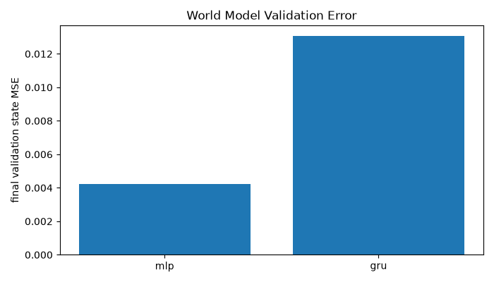
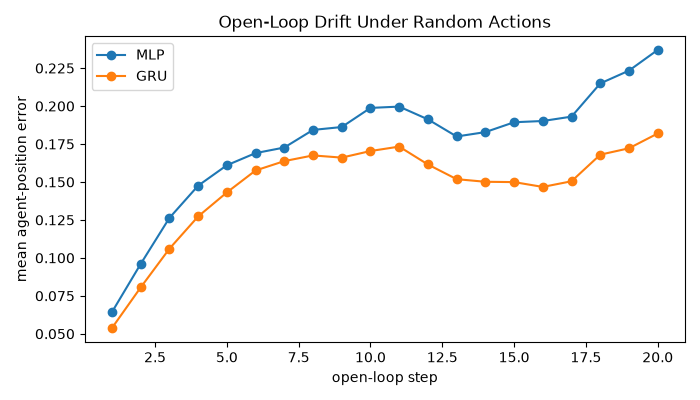

# Imagination Gridworld

A beginner world-model project inspired by Ha & Schmidhuber: collect low-dimensional
gridworld transitions, train a learned dynamics model, then train a DQN controller
inside that learned model.

## Quickstart

```bash
uv sync --extra dev
uv run collect-data --episodes 1000
uv run train-world-model --epochs 30
uv run train-world-model --model-type gru --sequence-length 8 --epochs 30
uv run benchmark-world-models --epochs 10
uv run train-controller --episodes 500
uv run evaluate
uv run serve
```

Open the printed local URL to inspect real vs imagined rollouts and drift.

`train-world-model` uses an MLP by default. Pass `--model-type gru` to train the
sequence model on contiguous rollout windows. GRU training requires data
collected by the current `collect-data` command because older transition files
do not include episode boundary metadata.

## Benchmarks

Compare the MLP and GRU world models with:

```bash
uv run collect-data --episodes 1000
uv run benchmark-world-models --epochs 50 --sequence-length 8
```

The benchmark trains both models from the same transition file with early
stopping enabled by default. `--epochs` is the maximum epoch cap; each model can
stop earlier when validation state MSE stops improving. Tune convergence with
`--early-stopping-patience` and `--min-delta`.

The benchmark writes:

- `runs/benchmarks/benchmarks.json`: training time, validation losses, inference
  throughput, and open-loop drift metrics.
- `runs/benchmarks/validation_mse.png`: final validation state MSE by model.
- `runs/benchmarks/open_loop_drift.png`: mean open-loop position error over
  rollout steps under shared random actions.

Example local CPU result with 250 collected episodes, max 50 training epochs,
early-stopping patience 5, sequence length 8, 25 drift rollouts, and horizon 20:

| Model | Epochs trained | Final val state MSE | Mean open-loop drift | Train seconds | Inference steps/sec |
| --- | ---: | ---: | ---: | ---: | ---: |
| MLP | 16 | 0.0042 | 0.1754 | 4.67 | 7,982 |
| GRU | 50 | 0.0130 | 0.1471 | 61.35 | 2,101 |

In this run, the MLP still wins on one-step validation state MSE and speed, but
the longer-trained GRU produces lower open-loop drift over imagined rollouts.

After running the benchmark, view the diagrams here:





The MLP is expected to outperform the GRU on one-step validation error here
because the gridworld state is already fully observable and Markovian:
`agent_x`, `agent_y`, `goal_x`, and `goal_y` plus the action are enough to
predict the next transition. The GRU adds recurrent capacity that is useful for
partial observability or hidden temporal state, but this environment has little
history-dependent structure for it to exploit. With longer training, the GRU can
still improve rollout consistency, which is why it wins on open-loop drift in
the example above despite being slower and worse on one-step MSE.

## Project Shape

- `src/grid_world/env.py`: deterministic numeric-state gridworld.
- `src/grid_world/data.py`: random-policy transition collection and datasets.
- `src/grid_world/models.py`: MLP world model, optional GRU world model, DQN.
- `src/grid_world/train_world_model.py`: supervised dynamics training.
- `src/grid_world/train_controller.py`: DQN trained only against the learned model.
- `src/grid_world/evaluate.py`: real vs imagined evaluation artifacts.
- `src/grid_world/web.py`: FastAPI app serving a vanilla Canvas UI.
